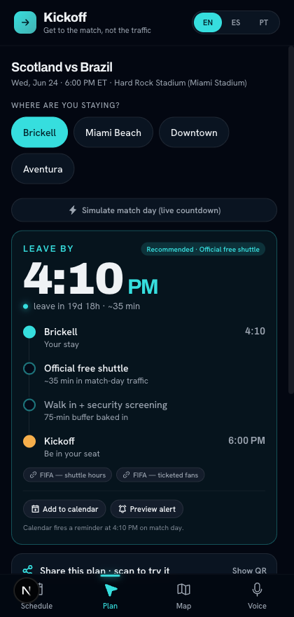
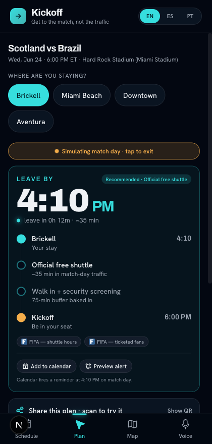
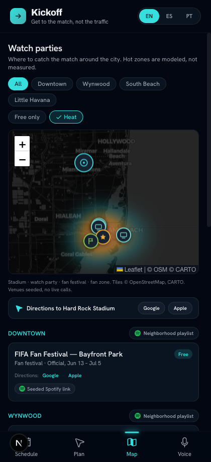
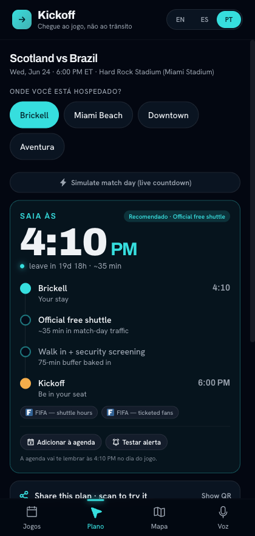
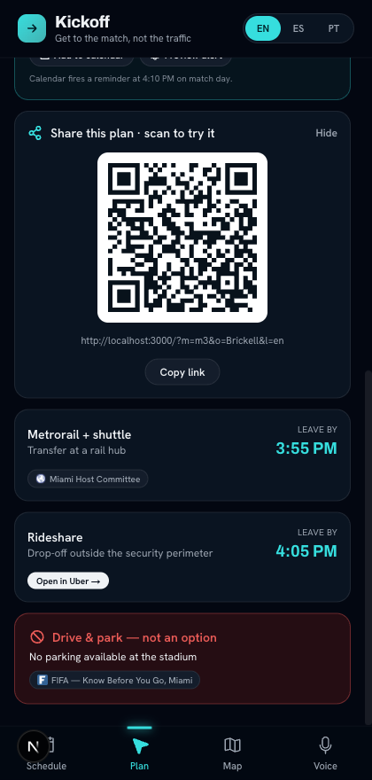

<!-- KICKOFF · World Cup 26 Miami · Aqua Departure Board -->

<div align="center">



<br/>

[](https://kickoff-brown-tau.vercel.app)


**The match-day companion for the FIFA World Cup&nbsp;26™ in Miami.**
Routes every fan to the right way into Hard Rock Stadium, in their language, and plugs them into the city's watch-party scene.

</div>


## Why this matters

> Getting **65,000 fans** into Hard Rock Stadium is solved on paper and a disaster in practice.

The **2024 Copa América final at this exact stadium** ended in a dangerous crowd crush. Miami hosts **7 World Cup matches** (Jun 15 to Jul 18, 2026). The stadium sits in suburban Miami Gardens with **no rail at the gates**, **no stadium parking**, and a shuttle that is **ticketholder-only**. Most fans will not know any of that until they are already stuck in it.

**Kickoff fixes the first mile.**


## The one rule that wins the room

> **Departure times are computed in code, never generated by an LLM.**

The model only translates and fills a fixed template, so it can **never hallucinate a wrong "leave by" time.** Every fact (no parking, ticketholder-only shuttle, the 3.5h pre-match shuttle window, the Copa crush) ships with a **tappable source link**. When a judge asks "is this real?", the proof is one tap away.

The verified engine lives in [`reference/arrival_router.py`](reference/arrival_router.py) (tested) and is ported 1:1 to [`lib/arrivalEngine.ts`](lib/arrivalEngine.ts).


## What it does

| Feature | What it does |
|---|---|
| **Schedule** | The 7 real Miami matches. Tap one to start. |
| **Arrival plan** | Where you are staying, then a **ranked** plan with a **computed** "leave by", shuttle / Metrorail / rideshare, an Uber deep link, and a red **"no parking" hard-stop**. |
| **Live countdown** | An honest, ticking *"leave in 12 min"* anchored to the real match clock. |
| **Heat map** | Watch parties and restaurants, hottest zones glowing, with **Google and Apple Maps directions** to the stadium and every venue. |
| **Multilingual and voice** | **EN · ES · PT.** Speak a query in Portuguese and the plan **reads back** in Portuguese. |
| **Leave-by alerts** | A real **calendar reminder** (`.ics`) that fires on match day. |
| **Share and QR** | Scan a code, and your exact plan loads, in your language, on someone else's phone. |


## See it

<table>
<tr>
<td align="center" width="20%"><br/><sub><b>The plan</b><br/>Leave by 4:10 PM</sub></td>
<td align="center" width="20%"><br/><sub><b>Match-day mode</b><br/>leave in 12 min</sub></td>
<td align="center" width="20%"><br/><sub><b>Heat map</b><br/>plus directions</sub></td>
<td align="center" width="20%"><br/><sub><b>Português</b><br/>same computed time</sub></td>
<td align="center" width="20%"><br/><sub><b>Scan to try it</b><br/>loads on your phone</sub></td>
</tr>
</table>

<div align="center">

**Try it on your phone:** [kickoff-brown-tau.vercel.app](https://kickoff-brown-tau.vercel.app) · or jump straight to a plan in Portuguese, [`?m=m3&o=Brickell&l=pt`](https://kickoff-brown-tau.vercel.app/?m=m3&o=Brickell&l=pt)

</div>


## Built with

**Next.js 16** (App Router, Turbopack, fully static) · **React 19** · **TypeScript** · **Tailwind v4** · **react-leaflet** with `leaflet.heat` (CARTO dark tiles) · **motion** · the **Web Speech API** (STT and TTS) · `qrcode.react` · shipped on **Vercel**.

Design system, *Aqua Departure Board*: one electric-aqua accent for **go**, amber for **urgency**, coral for **stop**; **Archivo** display with **Hanken Grotesk** body; huge tabular departure-board numbers.

> **Demo-proof by design.** Every byte the app needs is seeded: matches, venues, sources, playlists. No live scrape, no API call on shaky venue wifi. The map degrades to a filtered list if the tiles ever fail.

<details>
<summary><b>Run it locally</b></summary>

```bash
git clone https://github.com/ShawnMadadha/kickoff.git
cd kickoff
npm install
npm run dev          # http://localhost:3000
npm run build        # production build (static)
npm test             # vitest, engine + countdown guards
```

</details>

<details>
<summary><b>Repo structure</b></summary>

```
kickoff/
├── app/                     Next.js App Router (one static page)
├── components/              AppShell, Plan, Map, Voice, Schedule, ...
│   └── map/                 Leaflet canvas + heat overlay (client-only)
├── lib/
│   ├── arrivalEngine.ts     deterministic routing core (the moat)
│   ├── countdown.ts         honest, anchored, never-negative countdowns
│   ├── i18n.ts              EN/ES/PT dictionary (no translation API)
│   ├── calendar.ts          real .ics with a match-day VALARM
│   └── directions.ts        Google / Apple Maps hand-off
├── data/                    seeded matches, venues, sources, playlists
└── reference/arrival_router.py   the tested reference engine
```

</details>


<div align="center">
<sub>Built at the <b>Cursor Miami Hackathon</b>, The DOCK, Wynwood. Designed, built, and shipped to production live.</sub>
</div>
